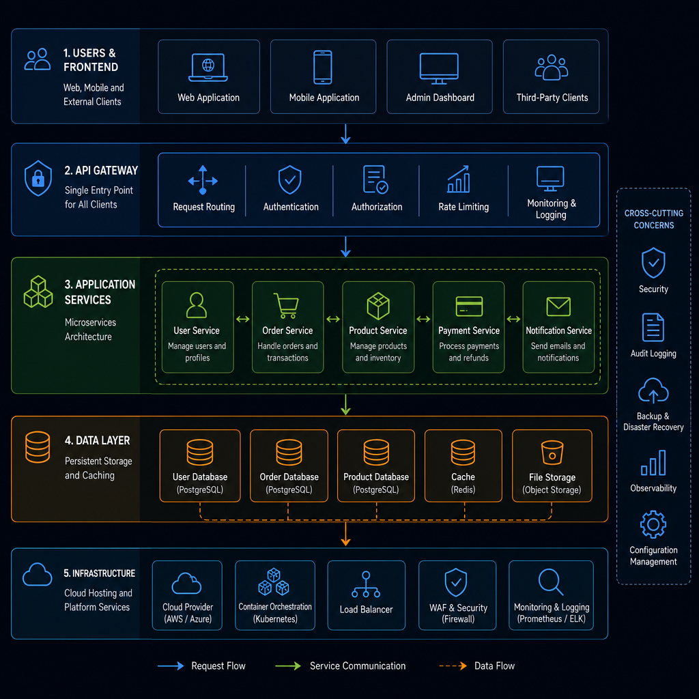
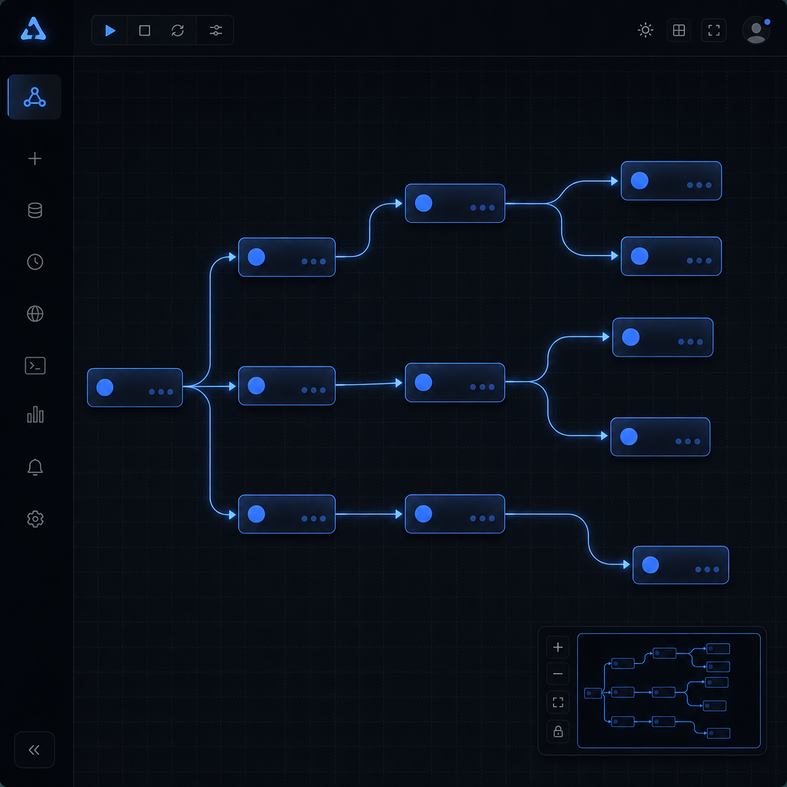

<div align="center">

<p align="center">
  <a href="README.md">English</a> | <a href="README.zh-CN.md">中文</a>
</p>


# Multimodal Data Lake

### 企业级多模态数据湖仓智能运营平台

**One Platform to Rule Them All** — 接入、入湖、索引、检索、治理、编排、运维、AI，一站搞定。

[](https://python.org/)
[](https://fastapi.tiangolo.com/)
[](https://react.dev/)
[](https://vitejs.dev/)
[](https://lancedb.com/)
[](https://ray.io/)
[](LICENSE)

<br/>

[快速开始](#-quick-start) · [功能全景](#-capability-panorama) · [架构设计](#-architecture) · [API 文档](#-api-surface) · [部署指南](#-deployment)

</div>

---

## Why Multimodal Data Lake?

> **这不是一个 Demo，这是一个平台。**

传统方案的痛点：
- 数据散落在各个系统，格式五花八门
- 向量检索、SQL 查询、文件管理各自为战
- 工作流编排靠人工拼接，算子复用率低
- 湖仓运维和数据治理是两套割裂的界面

**Multimodal Data Lake 把这些全部统一到一个平台里。**


---

## Capability Panorama

<div align="center">

| 🏗️ 数据接入 | 🔍 统一检索 | ⚡ 工作流编排 | 🛡️ 数据治理 |
|:---:|:---:|:---:|:---:|
| 本地上传 · 目录扫描 | SQL · 向量 · 多模态 | DAG 画布 · 算子中心 | 资产目录 · 版本回滚 |
| 来源接入 · 批量任务 | AI 副驾驶 · RAG | 模板库 · 任务中心 | Compaction · 治理视图 |

| 🤖 AI 能力 | 🏭 湖仓运维 | 👥 权限管控 | 📊 多模态专题 |
|:---:|:---:|:---:|:---:|
| BGE · CLIP · Whisper | MPP · Doris · SQL 编辑器 | RBAC · 用户管理 | 自动标注 · 检测追踪 |
| DeepSeek · Agent Team | 告警监控 · 自动巡检 | 系统日志 · 审计 | 复核清单 · 专题数据集 |

</div>

---

## Architecture

<div align="center">

</div>

```
┌─────────────────────────────────────────────────────────────────────┐
│                          React 18 + Arco Design                     │
│   湖总览 · 湖查询 · 湖计算 · 湖存储 · 湖治理 · 湖运维 · 系统配置    │
└───────────────────────────────┬──────────────────────────────────────┘
                                │
                                ▼
┌─────────────────────────────────────────────────────────────────────┐
│                          FastAPI Backend                            │
│                                                                     │
│   upload    search    files     dashboard    workbench              │
│   platform  operators versions  users        permissions            │
│   ray       doris     mpp      agents       multimodal             │
└────────────────┬────────────────────────────┬───────────────────────┘
                 │                            │
                 ▼                            ▼
┌────────────────────────────────┐  ┌────────────────────────────────┐
│         Storage Layer          │  │        AI / Compute            │
│                                │  │                                │
│   SeaweedFS / S3 对象存储      │  │   BGE / CLIP / Whisper         │
│   LanceDB 向量湖               │  │   DeepSeek / 本地模型          │
│   SQLite 元数据                │  │   Ray 分布式计算               │
│   Doris 联邦查询               │  │   Agent Team 协作              │
└────────────────────────────────┘  └────────────────────────────────┘
```

---

## Quick Start

### 1. 克隆项目

```bash
git clone https://github.com/854875058/multimodal-data-lake.git
cd multimodal-data-lake
```

### 2. 创建 Python 环境

```bash
conda create -n multimodal-lake python=3.11 -y
conda activate multimodal-lake
pip install "numpy<2.0"
pip install -r requirements.txt
```

### 3. 构建前端

```bash
cd frontend
npm install
npm run build
cd ..
```

### 4. 配置环境

```bash
cp .env.example .env
# 编辑 .env，配置 S3、LanceDB、DeepSeek 等连接信息
```

### 5. 启动平台

```bash
python start.py start
```

<div align="center">

| 入口 | 地址 |
|:---:|:---:|
| 🖥️ 平台首页 | `http://127.0.0.1:27843/` |
| ⚡ 工作流编排 | `http://127.0.0.1:27843/workflow` |
| 📚 API 文档 | `http://127.0.0.1:27843/docs` |
| ❤️ 健康检查 | `http://127.0.0.1:27843/api/health` |

</div>

常用命令：

```bash
python start.py status    # 查看状态
python start.py restart   # 重启服务
python start.py stop      # 停止服务
```

---

## Functional Surfaces

### 🏠 湖总览
- Dashboard 实时监控
- 资产目录与文件浏览
- 模态分布、趋势分析、知识图谱

### 🔍 湖查询
- SQL 查询编辑器
- 统一检索（关键词 + 语义）
- 向量 / 多模态 / 混合检索
- AI 数据副驾驶

### ⚡ 湖计算
- **可视化工作流画布** — 拖拽式 DAG 编排
- 算子中心 — 10+ 内置算子，支持自定义扩展
- 模板库 — 预设工作流一键加载
- 任务中心 — 作业实例管理

### 📦 湖存储
- 本地上传与批量扫描
- 来源接入与自动索引
- Lance 数据集管理

### 🛡️ 湖治理
- 资产目录与治理视图
- 版本统计、历史查看、回滚
- Compaction 管理建议

### 🏭 湖运维
- MPP 集群管理
- SQL 编辑器与 Doris 外表
- 告警监控与自动巡检

### 👥 系统配置
- 用户管理与 RBAC 权限
- 系统日志与审计
- LLM 模型配置

### 🤖 AI Agent Team
- BrainAgent — 任务分析与拆解
- CodeAgent — 代码生成
- TestAgent — 测试校验
- AgentCoordinator — 协同编排

---

## Workflow Studio

<div align="center">

</div>

**核心特性：**
- 🎨 可视化 DAG 画布，拖拽式节点编排
- 🔗 拖拽连线，实时预览数据流
- 📝 节点参数内联配置
- 🤖 LLM 模型选择器
- 🔍 画布缩放 + 小地图导航
- 📦 预设模板一键加载
- ⚡ Ray Job 预览与执行

**内置算子：**

| 算子 | 类型 | 功能 |
|:---|:---:|:---|
| 正则隐私脱敏 | 处理 | 手机号、邮箱、身份证等隐私字段脱敏 |
| 文本按长度切分 | 处理 | 长文本按指定长度切分，支持重叠 |
| 哈希去重 | 处理 | 按内容哈希去重，支持 MD5/SHA256 |
| CSV 转 JSON | 转换 | CSV 文件逐行转为 JSON 数组 |
| 关键词过滤 | 过滤 | 按关键词筛选文件，支持包含/排除 |
| 小文件合并 | 合并 | 多个小文件合并为单个文件 |
| 元数据提取 | 分析 | 提取文件行数、字符数、类型等元数据 |
| PPT 转 Markdown | 转换 | PPT/PPTX 转 Markdown（待集成） |
| 视频隐私模糊 | 增强 | 视频帧隐私区域模糊（待集成） |
| 视频冗余过滤 | 增强 | 去除冗余帧（待集成） |

---

## Tech Stack

<div align="center">

### Frontend


### Backend


### Storage & Query


### AI & Compute


</div>

---

## Supported Data Types

| 类型 | 格式 |
|:---|:---|
| 📄 文本 | `txt` `md` `log` `csv` `json` `jsonl` |
| 📑 文档 | `pdf` `docx` `pptx` |
| 📊 表格 | `xlsx` `xls` `csv` |
| 💻 代码 | `py` `js` `ts` `java` `go` `html` `xml` `yaml` `sql` |
| 🖼️ 图像 | `jpg` `jpeg` `png` `gif` `bmp` `webp` |
| 🎵 音频 | `mp3` `wav` `m4a` |
| 🎬 视频 | `mp4` `avi` `mov` |
| 📦 压缩包 | `zip` `tar` `gz` `tgz` |

---

## API Surface

| 模块 | 路径 | 说明 |
|:---|:---|:---|
| 📤 数据接入 | `/api/upload` | 文件上传、批量入湖、ETL |
| 🔍 检索 | `/api/search` | 统一检索、向量检索、多模态查询 |
| 📁 文件 | `/api/files` | 文件资产、预览、内容访问 |
| 📊 看板 | `/api/dashboard` | 统计指标、趋势、图谱 |
| 🔧 工作台 | `/api/workbench` | 设置、扫描、建索引、任务 |
| ⚙️ 平台 | `/api/platform` | 组件状态、外表、配置、LLM |
| ⚡ 算子 | `/api/operators` | 算子注册、校验、执行 |
| 📜 版本 | `/api/versions` | 版本统计、回滚、compaction |
| 👤 用户 | `/api/users` | 登录、注册、管理 |
| 🔐 权限 | `/api/permissions` | RBAC 角色权限 |
| 📡 系统 | `/api/system` | 状态、资源、日志 |
| 🚀 Ray | `/api/ray` | 分布式计算编排 |
| 🏭 Doris | `/api/doris` | 集群与外表能力 |
| 🔄 MPP | `/api/mpp` | 代理与转发 |
| 🤖 Agent | `/api/agents` | 多 Agent 协作 |
| 🎭 多模态 | `/api/multimodal` | 专题、标注、追踪 |

---

## Repository Layout

```
multimodal-data-lake/
├── frontend/                    # React 18 + Vite 7 前端
│   └── src/
│       ├── pages/               # 业务页面（20+ 页面）
│       ├── components/          # 组件（含工作流画布）
│       ├── api/                 # API 客户端
│       └── auth/                # 登录态管理
├── backend/
│   ├── api/                     # FastAPI 路由模块（16+ 模块）
│   └── operators_migrated/      # 已迁移算子（10 个）
├── agents/                      # 多 Agent 协作模块
├── docs/                        # 文档与资源
├── tests/                       # pytest 测试
├── etl.py                       # ETL 主流程
├── models_loader.py             # 模型与 LanceDB 访问
├── multimodal_store.py          # 多模态专题存储
├── database.py                  # SQLite 元数据
├── config.py                    # 全局配置
└── start.py                     # 单入口启动脚本
```

---

## Typical Scenarios

### 📚 场景 1：企业资料统一入湖与检索

> 资料散、格式杂、历史包袱重？

- PDF、Word、PPT、图片、音视频统一接入
- 自动抽取、切片、向量化、索引
- 关键词 + 语义搜索统一入口
- 给问答、副驾驶、治理提供统一底座

### 🛡️ 场景 2：多模态资产治理与版本追踪

> 资产多，但缺版本治理？

- Catalog / Schema / Table 统一视图
- Lance 数据集版本统计、回滚、Compaction
- 治理台账替代"靠人记忆"

### ⚡ 场景 3：工作流编排与任务化执行

> 流程长、人工拼接多、算子复用低？

- DAG 画布拖拽编排
- 模板库、作业实例、任务中心
- Ray 分布式计算集成

### 🏭 场景 4：湖仓一体查询与运维

> 数据在湖里、查询在仓里、运维在多个系统里？

- Doris 外表 + MPP 代理 + SQL 编辑器
- 告警监控 + 自动巡检 + 系统日志
- 运维和治理不再割裂

### 🎭 场景 5：多模态专题与自动化标注

> 检测、复核、追踪、标注？

- 专题数据集管理
- 自动化标注任务
- 检测追踪与复核清单

---

## Positioning

<div align="center">

> **Multimodal Data Lake 是一个面向企业场景的多模态数据湖仓运营平台，**
> **统一覆盖数据接入、内容解析、向量化入湖、统一检索、资产治理、**
> **工作流编排、MPP/Doris 运维、权限管控与 AI Agent 协作。**
>
> **它不是单点能力展示，而是平台级控制面的完整雏形。**

</div>

---

## Contributing

欢迎贡献！请遵循以下流程：

1. Fork 本仓库
2. 创建特性分支 (`git checkout -b feature/amazing-feature`)
3. 提交更改 (`git commit -m 'feat: add amazing feature'`)
4. 推送到分支 (`git push origin feature/amazing-feature`)
5. 创建 Pull Request

---

## License

MIT License - 详见 [LICENSE](LICENSE)

---

<div align="center">

**Built with ❤️ by the Multimodal Data Lake Team**

[](https://star-history.com/#854875058/multimodal-data-lake&Date)

</div>
